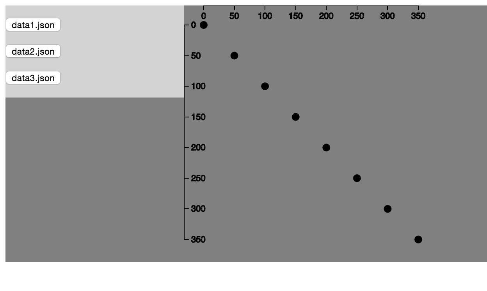

# Challege 2: Multi-pane Visualisation

Create a multi-pane visualisation as shown in end-result{1,2,3}.png

The left side shows a list of buttons.
Each button corresponds to a data set listed in the datasets.json file. 
Once clicked, that data set should be loaded, and shown on the right side; replacing the old set

The right side shows a scatter plot with the selected data set

The code from the updates-best.html will help a lot here!

Use starthere.html to get started. 

